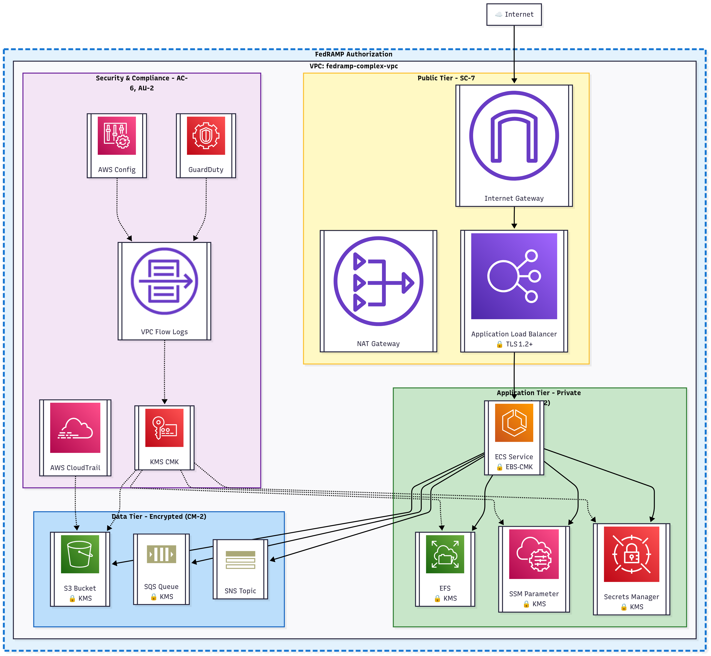

# Hayashi - Architecture Boundary Diagrams as Code



A Rust-based diagramming-as-code API that allows you to turn your .tfstate file into detailed architecture boundary diagrams.

## Overview

Hayashi transforms Terraform state files into visual architecture diagrams with security and compliance boundaries. Perfect for creating documentation that meets FedRAMP, NIST 800-53, and other compliance framework requirements.

## Features

- 🔄 **Automatic Diagram Generation**: Parse Terraform state files and generate Mermaid diagrams
- 🔒 **Security Boundary Visualization**: Clearly delineate authorization boundaries and trust zones
- 📋 **Compliance Controls**: Annotate resources with relevant security controls (SC-7, AU-2, AC-6, CM-2, etc.)
- 🏗️ **Architecture Tiers**: Automatically organize resources into public, application, and data tiers
- 🎨 **Customizable Styling**: Color-coded boundaries and security zones

## Installation

```bash
cargo install hayashi
```

Or build from source:

```bash
git clone https://github.com/yourusername/hayashi.git
cd hayashi
cargo build --release
```

## Usage

### Basic Usage

```bash
# Generate diagram from Terraform state
hayashi generate terraform.tfstate -o diagram.mmd

# Generate diagram with specific boundary name
hayashi generate terraform.tfstate --boundary "FedRAMP Authorization Boundary" -o diagram.mmd

# Output as SVG
hayashi generate terraform.tfstate --format svg -o diagram.svg
```

### API Usage

```rust
use hayashi::{TerraformParser, DiagramGenerator};

fn main() {
    // Parse Terraform state
    let state = TerraformParser::from_file("terraform.tfstate")?;

    // Generate diagram
    let diagram = DiagramGenerator::new()
        .with_boundary_name("FedRAMP Authorization Boundary")
        .with_compliance_controls(true)
        .generate(&state)?;

    // Save to file
    diagram.save("output.mmd")?;
}
```

### Configuration

Create a `hayashi.toml` configuration file:

```toml
[boundary]
name = "FedRAMP Authorization Boundary"
show_controls = true

[styling]
boundary_color = "#1976d2"
public_tier_color = "#fbc02d"
app_tier_color = "#2e7d32"
data_tier_color = "#1565c0"

[resources]
# Map resource types to tiers
public_tier = ["aws_internet_gateway", "aws_nat_gateway", "aws_lb"]
app_tier = ["aws_ecs_service", "aws_efs_file_system"]
data_tier = ["aws_s3_bucket", "aws_sqs_queue", "aws_sns_topic"]
```

## Supported Resources

Hayashi supports a wide range of AWS resources including:

- **Networking**: VPC, Internet Gateway, NAT Gateway, Load Balancers
- **Compute**: ECS, EKS, EC2, Lambda
- **Storage**: S3, EFS, EBS
- **Security**: KMS, Secrets Manager, Systems Manager Parameter Store
- **Monitoring**: CloudTrail, GuardDuty, Config, CloudWatch

## Output Formats

- **Mermaid** (`.mmd`) - For GitHub, documentation sites, and Markdown files
- **SVG** - For presentations and static documentation
- **PNG** - For image embedding
- **JSON** - For programmatic processing

## Contributing

Contributions are welcome! Please read our [Contributing Guide](CONTRIBUTING.md) for details.

## License

This project is licensed under the MIT License - see the [LICENSE](LICENSE) file for details.

## Acknowledgments

- Built with Rust 🦀
- Diagram rendering powered by Mermaid.js
- Icons from AWS Architecture Icons and IcePanel
